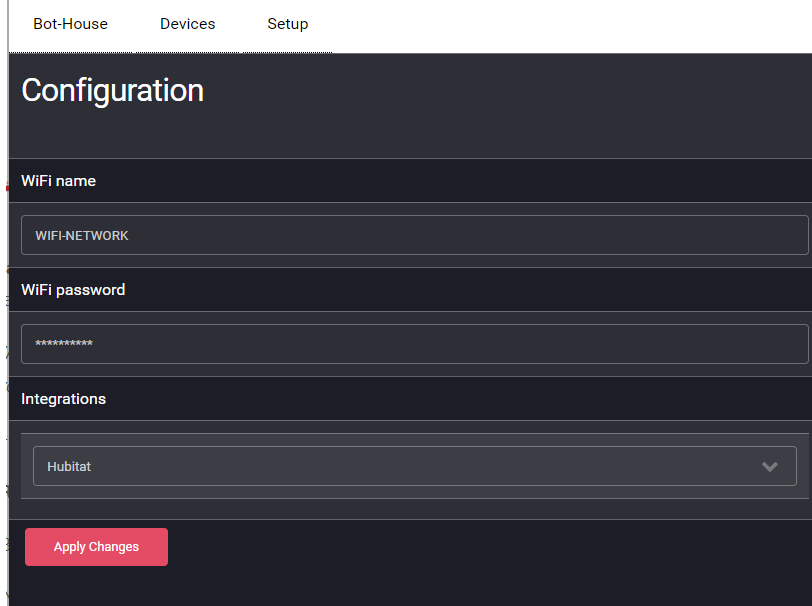

# What is bot.house?
BotHouse is a configurable IoT Framework running on ESP-based processors, like ESP-8266, ESP-12S, or ESP01. Multiple bot.house nodes can self-organize and create a mesh network where some of the nodes become stations (STA) and others become access point repeaters (AP) depending on their proximity and signal strength from each other. Each node can be configured to work as a switch or switches, a button or buttons, or switch relay. The later let's you control for instance a light switch.

Right now BotHouse supports Hubitat home automation Hub, which you can use to program different types of routines.

BotHouse does not require the internet to run, it is capable of keep working regardless of network connectivity.

# Mesh Architecture
Here's a sample of how multiple bot.house devices will form a self-organizing mesh, where each node will automatically determine if becoming an AP or STA depending on the signal strenght from each other. 


# Instructions

## Arduino
1. Choose your hardware. I recommend the ESP8266 if you have sufficient space as this is a quite big component, then you can add additional components, such as Relays, buttons, etc. If you are concerned about space, like if you want to install bot.house inside a light switch, you can order the following components: 
   - [ESP8266 5V WiFi Relay Module](https://amzn.to/36h0xXX) <details><summary>Show image</summary></details>
   - [HLK-PM01 AC-DC 220V to 5V Step-Down Power Supply Module](https://amzn.to/39m590Q) <details><summary>Show image</summary></details>
1. Open the [Arduino folder](https://github.com/ljbotero/bot.house/tree/main/Arduino) with the the IDE of your choice (I like [Visual Studio Code](https://code.visualstudio.com/))
1. Open the /data folder and create your config files for the type of Hardware you are building. You might use the config_switch_relay.json as example to build a relay switch with the hardware listed above. Just make sure you rename the file name to config_[yourHawdwareId].json or just config.json.
1. Flash bot.house into your ESP hardware. I recommend using the Arduino IDE. Make sure you choose a flash with at least FS:512KB.
1. Flash the File System into the ESP hardware. There's an add in for Arduino IDE called "[ESP8266 Sketch Data Upload](https://github.com/esp8266/arduino-esp8266fs-plugin)" that I recommend for this purpose.
1. Setup your configuration by restarting your ESP hardware, then using your phone, connect to the Access Point with a name starting with botlocal. Once connected, open your browser and navigate to http://192.168.4.1. Setup your wifi name, password, and choose an iptional HUB, if you have one, then save changes.
1. Here's how it looks like once assembled and installed:
   

## Hubitat
1. From the Hubitat admin site, go to "Apps Code", then upload [Hubitat/bot-house-hubitat.groovy](Hubitat/bot-house-hubitat.groovy), save it, 
1. Click on OAuth button on top and enable it.
1. Navigate to Apps section, and click on [Add User App], choose BotHouse
1. Then the app will launch and start discovering any devices already deployed.
1. Once all devices have been found you can click the [Done] button.

# Configuration
You need to have at least one confg.json file in your data folder. This file contains the definitions that tell BotHouse how to interact with your hardware, The data-dev folder contains some sample definitions that you might use as starting point for your project. Below is the description of the config schema along with all options:

Take the following config.json as example:
```json
{
  "devices": [   
    {
      "deviceId": "",
      "description": "sample config",
      "typeId": "switch-relay",
      "setup": [
        {"pinId": 3, "mode": "INPUT_PULLUP", "isDigital": true, "initialValue": 1 }
      ],
      "events": [
        {"eventName": "On", "pinId": 3, "startRange": 0, "endRange": 0, "isDigital": true, "delay": 500 }, 
        {"eventName": "Off", "pinId": 3, "startRange": 1, "endRange": 1, "isDigital": true, "delay": 500}
      ],
      "commands": [
        {"commandName": "On", "action": "writeSerial", "pinId": 3, "value": 0, "values": "A00101A2" }, 
        {"commandName": "Off", "action": "writeSerial", "pinId": 3, "value": 1, "values": "A00100A1" },
        {"commandName": "Toggle", "action": "toggleDigital", "pinId": 3 }
      ],
      "triggers": [
        { "onEvent": "On", "fromDeviceId": "", "runCommand": "On" },
        { "onEvent": "Off", "fromDeviceId": "", "runCommand": "Off" },
        { "onEvent": "On", "fromDeviceId": "", "runCommand": "Broadcast" },
        { "onEvent": "Off", "fromDeviceId": "", "runCommand": "Broadcast" }
      ]
    }
 ]
}
```
* **devices**: This array might have more than one definition of device, in case you want to use the same config file for multiple hardware components. However, to have more than one you need to assign corresponding deviceId which is specific to the hardware component itself (chip id). It is recommended to have a single device definition per config file, but you have the choice.
* **deviceId**: Typically this field goes empty so that the same configuration is independent to the ChipId of the hardware.
* **typeId**: This is the type of hardware. Here are the different options: push-button | contact | on-off-switch | switch-relay | motion-sensor
* **setup**: This defines how to initialize your hardware. It runs on the setup sequence that configures the hardware. mode can be INPUT_PULLUP | INPUT | OUTPUT.
* **events**: Here's where tou define what pins to watch for changes and what event to raise when those changes happen. The delay is simply a way to prevent muliple repetitive events being raised on a short period of time.
* **commands**: Commands are executed by triggers or directly send to the device. You might choose from the following list of actions: toggleDigital | writeDigital | writeSerial | setState
* **triggers**: Triggers help connecting what actions to take when given events occur
   
# Admin UI

Admin UI allows administering all nodes in the Mesh. If the mesh is connected to your Wifi, you can access the mesh UI via http://bot.local  
If not connected to your WiFi, you might connect to one of the access points in the mesh, named as BotHouseXYZ, then open the following in your browser: http://192.168.4.1




